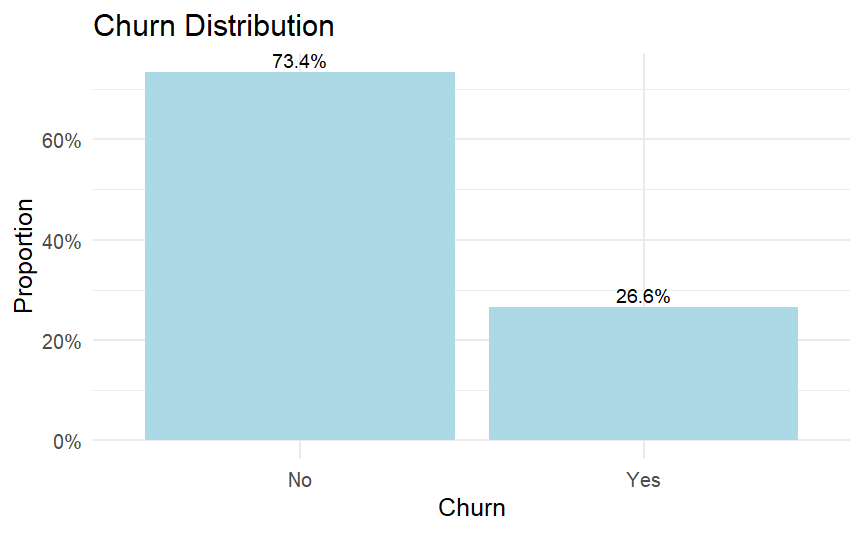
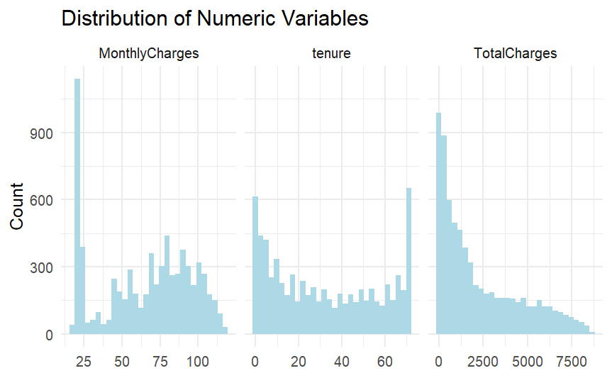
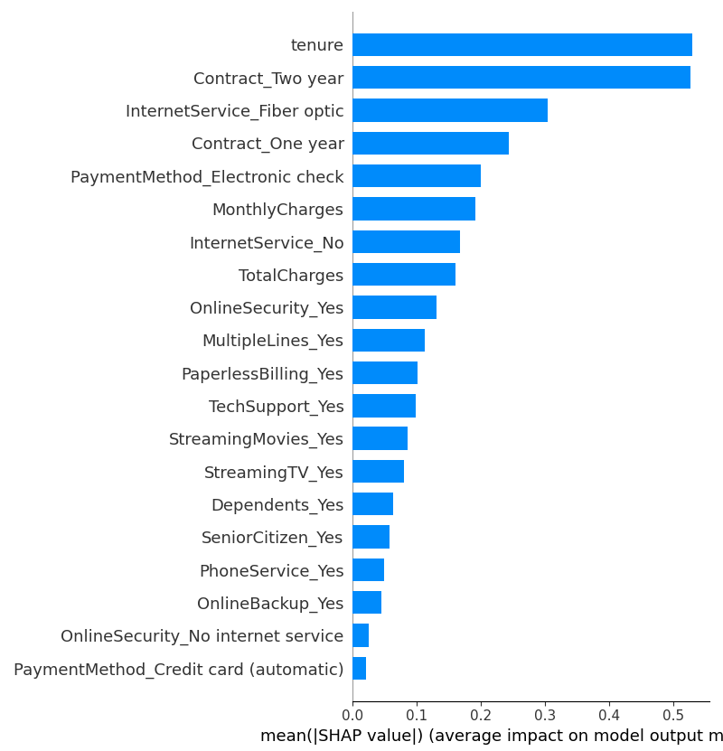
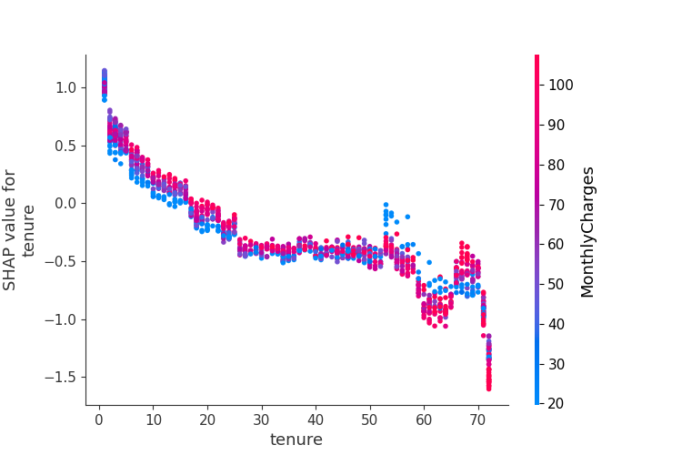
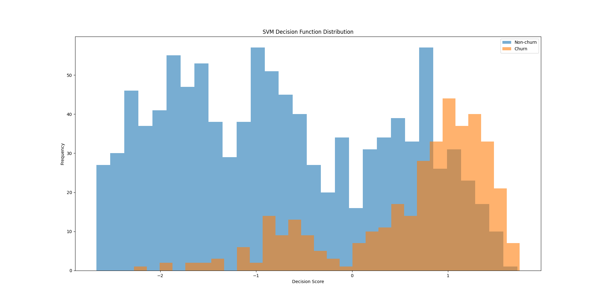
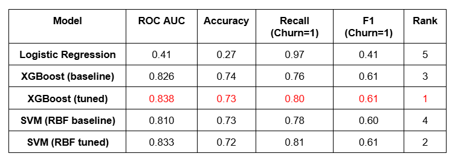

# Telco Customer Churn Analysis  
**Rebecca Li | UCLA Department of Statistics & Data Science**  

# 1. Introduction

Customer churn — the loss of existing subscribers — represents a major revenue risk for telecommunications companies. The goal of this project is to understand the behavioral and service-related factors driving churn, and provide modeling-ready insights for future predictive analysis (Logistic Regression & XGBoost & SVM). By examining distributions, feature relationships, and churn patterns, we aim to identify high-risk customer groups and actionable levers for churn reduction.

This project analyzes churn patterns in a Telco subscription dataset using:

- **R** for Exploratory Data Analysis (EDA)  
- **Python** for modelling Logistic Regression, XGBoost, and SVM  
- **Goal:** Identify key churn drivers, build predictive models, and provide actionable business insights.


# 2. Data Overview

The [TELCO Customer Churn dataset](https://www.kaggle.com/datasets/blastchar/telco-customer-churn/data) contains 7,043 customer records and 21 variables describing customer demographics, service subscriptions, contractual attributes, monthly billing, and a binary churn label. The dataset includes both numerical features (e.g., tenure, MonthlyCharges, TotalCharges) and multiple categorical variables related to phone, internet, and streaming services. 

Target variable: **Churn (Yes/No)**.

## 2.1 Data Cleaning 

We began by loading the raw Telco Customer Churn dataset and performing an initial inspection using glimpse() and summary() to understand variable types, missing values, and overall data quality. A missing-data check confirmed that the dataset contained 11 missing values, all located in the TotalCharges column. Because the proportion of missing rows was extremely small relative to the full dataset (11 out of 7,043 records), we chose a deletion-based approach rather than imputation to avoid introducing noise or bias.

```R
telco_raw = read.csv("C:/Users/lenovo/Desktop/Churn Project/WA_Fn-UseC_-Telco-Customer-Churn.csv")

glimpse(telco_raw)
summary(telco_raw)


any(is.na(telco_raw)) #check for missing value 
names(telco_raw)[colSums(is.na(telco_raw)) > 0] #target missing value 
sum(is.na(telco_raw$TotalCharges)) #11

telco = telco_raw %>%
  mutate(SeniorCitizen = if_else(SeniorCitizen == 1, "Yes","No"))%>%  #covert numerical variables to binary
  na.omit() #delete records with NA since there's only 11 records 


numeric_vars <- telco %>%
  select(where(is.numeric)) %>%
  names()

cat_vars <- telco %>%
  select(-all_of(numeric_vars)) %>%
  names()


#churn rate 
churn_summary <- telco %>%
  count(Churn) %>%
  mutate(prop = n / sum(n))
```
To clean the dataset, we first converted the SeniorCitizen field from a numeric indicator (0/1) into a human-readable categorical variable (“No”, “Yes”). Afterward, we separated variables into two groups—numeric features and categorical features—to facilitate later preprocessing, encoding, and exploratory analysis.

## 2.2 Data Preparation 

To prepare for the modelling stage, we started from the cleaned R output and loaded telco_cleaned.csv into Python. We defined the feature matrix X by dropping the target labels (Churn, churn_binary) and the identifier column (customerID), and used churn_binary as the binary target y. Categorical features were detected via their object dtype and one-hot encoded using pd.get_dummies(..., drop_first=True) to avoid dummy-variable traps. In total, 16 categorical columns were expanded into dummy variables, resulting in 30 features after encoding.

```python
df = pd.read_csv('telco_cleaned.csv')
print(df.head())

X = df.drop(["Churn","churn_binary", "customerID"], axis=1)  
y = df["churn_binary"]  

# Encode categorical features 
categorical_cols = X.select_dtypes(include=["object"]).columns
X_encoded = pd.get_dummies(X, columns=categorical_cols, drop_first=True)
print(f"\nEncoded {len(categorical_cols)} categorical columns") #16
print(f"Total features after encoding: {X_encoded.shape[1]}") #30

#train/test split (BEFORE scaling to avoid data leakage)
X_train, X_test, y_train, y_test = train_test_split(
    X_encoded, y, test_size=0.2, random_state=42, stratify=y
)

#scaling for SVM and Logistic Regression (fit on train, transform test)
numeric_cols = X_train.select_dtypes(include=["int64", "float64"]).columns
scaler = StandardScaler()
X_train_scaled = X_train.copy()
X_test_scaled = X_test.copy()
X_train_scaled[numeric_cols] = scaler.fit_transform(X_train[numeric_cols])
X_test_scaled[numeric_cols] = scaler.transform(X_test[numeric_cols])
```
Next, we split the data into training and test sets using an 80/20 split with stratify=y to preserve the original churn proportion in both sets. To prepare inputs for models that are sensitive to feature scales (Logistic Regression and SVM), we identified numeric columns and applied StandardScaler. Importantly, the scaler was fit only on the training data and then applied to both X_train and X_test, ensuring there was no data leakage from the test set into the training process. XGBoost, which is scale-invariant, was trained on the raw encoded features without standardization.

# 3. Exploratory Data Analysis (EDA)

EDA was conducted in R (tidyverse + ggplot2) to understand customer behavior and identify early indicators of churn.  
Key findings highlight imbalances in churn rates, differences in distributions of numeric variables, and a clear separation between churn and non-churn groups.

## 3.1 Churn Distribution

The dataset is imbalanced:  
- **73.4%** customers did **not** churn  
- **26.6%** customers **did** churn  

This imbalance is common in churn problems and motivates the use of AUC, recall, and precision instead of relying solely on accuracy. Because of that, we adopt XGBoost model since it works well with imbalances.

### **Plot: Churn Distribution**




## 3.2 Distribution of Numeric Variables

We examine three key numeric variables:

- MonthlyCharges
- tenure
- TotalCharges

Observations:

- Tenure has a reverse-J shape, typical in telecom retention patterns.
- TotalCharges is positively skewed, consistent with long-tenure customers accumulating more charges.
- MonthlyCharges has a fairly uniform spread.




# 4. Logistic Regression 

Logistic Regression is used as the baseline because it offers strong interpretability and sets a reference point for more complex models such as XGBoost and SVM.

### **Model Workflow**

- Standardized numerical variables  
- Trained on train split  
- Evaluated on test split using accuracy, AUC, precision, recall, and F1  


```python
log_reg = LogisticRegression(
    max_iter=1000,
    class_weight="balanced",    
    penalty="l2",
    random_state=42
)


log_reg.fit(X_train_scaled, y_train)


y_pred = log_reg.predict(X_test)
y_pred_prob = log_reg.predict_proba(X_test)[:, 1]


print("ROC AUC:", roc_auc_score(y_test, y_pred_prob))
print(classification_report(y_test, y_pred))


```
By using balanced class weight in logistic regression, we treat churners as more important because there are fewer of them. In other words, churners get more weight, non-churners get less weight. It helps to increase recall of churners, avoid the predict-all-0 trap, and reduce the effect of imbalance. 

```text
ROC AUC: 0.4126848750588857

precision    recall  f1-score   support

           0       0.63      0.02      0.04      1033
           1       0.26      0.97      0.41       374

    accuracy                           0.27      1407
      1407
weighted avg       0.53      0.27      0.14      1407
```

Logistic Regression performed very poorly in this churn prediction task, even with balanced class weight and standardized numeric variables. The model achieved an AUC of 0.41, far below acceptable baseline performance, and the classification report shows extreme imbalance in prediction behavior:

- It almost always predicts the minority class (churn = 1)
- Recall for non-churn customers is 0.02, meaning it completely fails to recognize the majority class
- Accuracy is only 27%, far below the majority baseline of ~73%

This happens because the decision boundary in churn data is highly nonlinear and cannot be captured by a linear model like Logistic Regression. The Telco churn dataset contains complex interactions between contract type, tenure, services, and billing features—patterns that linear models cannot express. As a result, Logistic Regression collapses into a degenerate classifier and fails to generalize, confirming the need for more flexible models such as XGBoost or SVM.


# 5. XGBoost 

XGBoost is a tree-based gradient boosting algorithm known for its strong performance on tabular datasets.  
In churn prediction tasks, it often outperforms linear models by capturing nonlinear interactions between features such as tenure, contract type, and billing behavior.

We evaluate two variants:
1. **Baseline XGBoost**
2. **Tuned XGBoost (GridSearchCV)**

## 5.1 Baseline XGBoost

The baseline model uses default hyperparameters.  
This provides a reference to evaluate how much tuning improves performance.

```python
X_train_xgb = X_train  
X_test_xgb = X_test

# handle imbalance: ratio = (# non-churn) / (# churn)
neg, pos = y_train.value_counts()
scale_pos_weight = neg / pos
print("scale_pos_weight:", scale_pos_weight) #2.76


xgb_model = XGBClassifier(
    n_estimators=300, #number of trees
    learning_rate=0.05,#prevent overfitting
    max_depth=5, #depth of each tree
    subsample=0.8, #fraction of samples used for each tree
    colsample_bytree=0.8, #fraction of features used for each tree
    scale_pos_weight=scale_pos_weight,   # imbalance correction
    eval_metric="logloss",
    random_state=42
)

xgb_model.fit(X_train_xgb, y_train)

y_pred_xgb = xgb_model.predict(X_test_xgb)
y_pred_prob_xgb = xgb_model.predict_proba(X_test_xgb)[:, 1]

print("XGBoost ROC AUC:", roc_auc_score(y_test, y_pred_prob_xgb))
print(classification_report(y_test, y_pred_xgb))
```
To address churn imbalance, we computed scale_pos_weight as the ratio of non-churn to churn customers (2.76), allowing the model to penalize mistakes on the minority class more heavily. We selected 300 trees with a conservative learning rate of 0.05 to reduce overfitting while giving the model enough boosting rounds to learn complex patterns. A tree depth of 5 captures nonlinear relationships without becoming overly complex, and both subsample=0.8 and colsample_bytree=0.8 introduce stochastic regularization that improves generalization.

```text
 XGBoost ROC AUC: 0.8262433284499225
```
The baseline XGBoost model already performed strongly, achieving an AUC of 0.826, confirming that tree-based boosting methods are well-suited for capturing the nonlinear structure of churn data. However, XGBoost contains many hyperparameters that control tree depth, learning rate, subsampling, and feature sampling—each of which can meaningfully influence model complexity and generalization. To push performance further and systematically explore these interactions, we conducted an extensive hyperparameter search using GridSearchCV.


## 5.2 XGBoost Hyperparameter Tuning (GridSearchCV)

Tuning aims to balance bias–variance tradeoff and improve generalization.

Several approaches can be used for hyperparameter tuning in machine learning models:
1. GridSearchCV – Exhaustively evaluates all combinations of hyperparameters across a predefined search grid using cross-validation. It is stable, fully reproducible, and easy to interpret.
2. RandomizedSearchCV – Samples a fixed number of random hyperparameter combinations from specified distributions. It is faster and suitable for large search spaces, but does not guarantee testing all meaningful combinations.
3. Bayesian Optimization frameworks (e.g., Optuna, Hyperopt) – Use past evaluation results to intelligently suggest the next promising hyperparameter set. These methods are highly efficient for very large or complex search spaces but introduce more complexity and less transparency.
For this churn prediction project, GridSearchCV is the most appropriate choice because:
- The dataset is medium-sized, and XGBoost training is relatively fast.
- Our hyperparameter space is deliberately small and well-defined.
- Exhaustive search provides deterministic, interpretable, and reproducible results.
- It allows us to clearly demonstrate the tuning process in a way that aligns with industry-standard practices and makes the methodology easy to communicate in interviews or documentation.

The cross-validation step in GridSearchCV plays a key role here: instead of fitting parameters purely to the training split—which risks overfitting—CV repeatedly evaluates each parameter combination across multiple folds of the training data. This ensures the selected hyperparameters consistently perform well on unseen data, resulting in a more stable and reliable model.

```python
param_grid = {
    "max_depth": [3, 5, 7],
    "learning_rate": [0.05, 0.1],
    "n_estimators": [200, 400],
    "subsample": [0.8, 1.0],
    "colsample_bytree": [0.8, 1.0],
}

grid_search = GridSearchCV(
    estimator=xgb_model,
    param_grid=param_grid,
    scoring="roc_auc",
    cv=3,
    n_jobs=-1,
    verbose=1
)

grid_search.fit(X_train_xgb, y_train)

print("Best params:", grid_search.best_params_)
```
```text
{'colsample_bytree': 0.8, 'learning_rate': 0.05, 'max_depth': 3, 'n_estimators': 200, 'subsample': 0.8}
```
From GridSearchCV, we obtained the best parameters for XGBoost, which are: 

max_depth = 3
- Shallower trees reduce model complexity and prevent overfitting, especially important in tabular datasets with correlated features.

learning_rate = 0.05
- A small learning rate provides more stable, incremental updates and improves generalization by preventing overly aggressive boosting steps.

n_estimators = 200
- Enough boosting rounds to capture meaningful nonlinear patterns without introducing excessive noise or training instability.

subsample = 0.8
- Uses 80% of the training samples per tree, adding randomness that reduces variance and prevents overfitting.

colsample_bytree = 0.8
- Samples 80% of the features for each tree, improving robustness and reducing reliance on any single feature subset.

After tuning XGBoost with GridSearchCV and applying the optimized model to the test set, we achieved an AUC of 0.839, which is slightly higher than the baseline XGBoost model (AUC ≈ 0.826). This improvement indicates that the tuned hyperparameters helped the model generalize better by balancing model complexity and regularization.
```text
Test ROC AUC (best XGB): 0.8385031914728401

              precision    recall  f1-score   support
           0       0.91      0.70      0.79      1033
           1       0.49      0.80      0.61       374

    accuracy                           0.73      1407
   macro avg       0.70      0.75      0.70      1407
weighted avg       0.80      0.73      0.74      1407
```

## 5.3 Model Interpretation 

The SHAP feature importance plot shows that the tuned XGBoost model relies primarily on tenure, contract type, and internet service type to make churn predictions. Tenure is by far the most influential variable, followed by long-term contract indicators (One-year, Two-year), highlighting how customer retention is strongly linked to subscription duration and contractual commitment. Features such as Electronic Check, Monthly Charges, Online Security, and Fiber Optic service also have substantial importance, indicating that both billing behaviors and service configurations affect churn risk. The dominance of these variables confirms that churn is shaped by a combination of service stability, pricing, and customer habits — and that linear models cannot adequately capture these nonlinear relationships.



The SHAP dependence plot for tenure reveals a clear, monotonic pattern: churn probability sharply decreases as tenure increases. Customers with extremely short tenure (0–10 months) exhibit high positive SHAP values, meaning they contribute strongly toward churn predictions. As tenure increases beyond ~20 months, SHAP values rapidly drop below zero, indicating much lower churn risk. This aligns with real-world business intuition — new customers are far more volatile, while long-standing subscribers are substantially more stable. The effect is smooth, continuous, and strongly nonlinear, which is exactly the kind of pattern tree-based models like XGBoost excel at capturing.



Overlaying MonthlyCharges as a color gradient further exposes interaction effects: within the same tenure range, customers with higher monthly charges tend to have slightly higher SHAP values (i.e., higher churn risk). This indicates that churn is not driven by tenure alone but by the interaction between how long the customer has stayed and how much they are paying. XGBoost naturally captures these multidimensional relationships without requiring manual feature engineering.

---

# 6. Support Vector Machine (SVM)  

SVM is a margin-based classifier that uses kernel transformations to identify nonlinear patterns in the churn data.  
Because SVM is highly sensitive to magnitudes of features, standardization is required to ensure balanced treatment across variables.

We evaluate:
1. **Baseline SVM**
2. **Tuned SVM (C, gamma GridSearchCV)**


## 6.1 Baseline SVM

SVM commonly offers several kernel choices:
1. Linear Kernel
Uses a straight-line (or hyperplane) boundary.
It works well when the data is approximately linearly separable or when the feature space is already high-dimensional after one-hot encoding. However, it cannot capture nonlinear churn patterns created by interactions between customer attributes.
2. Polynomial Kernel
Allows curved boundaries of polynomial form. Although more flexible than the linear kernel, it often introduces unnecessary complexity and tends to overfit medium-sized datasets such as churn data.
3. RBF (Radial Basis Function) Kernel
The RBF kernel maps points into a much higher-dimensional space where complex relationships become linearly separable. It produces smooth, nonlinear boundaries that adapt well to real-world structures in the data. RBF is generally the default and most robust choice for classification tasks involving heterogeneous or nonlinear feature interactions.

From EDA, we observed that customer churn patterns are rarely linearly separable. After one-hot encoding, the feature space becomes high-dimensional, and churn behavior depends on nonlinear interactions such as tenure × contract type × tech support status. The RBF kernel is well-suited to this scenario because it:
- captures nonlinear relationships between features
- handles complex customer behavior patterns
- avoids overfitting better than polynomial kernels
- consistently performs well in practical churn prediction tasks
For these reasons, we select the RBF kernel as the primary kernel for our SVM model.

```python
X_train_svm = X_train_scaled
X_test_svm = X_test_scaled

svm_rbf = SVC(
    kernel="rbf",
    C=1.0,             # default
    gamma="scale",      # default RBF gamma
    probability=True,   # needed for AUC
    class_weight="balanced",  # important for imbalanced churn data
    random_state=42
)

svm_rbf.fit(X_train_svm, y_train)

y_pred_svm = svm_rbf.predict(X_test_svm)
y_pred_svm_prob = svm_rbf.predict_proba(X_test_svm)[:, 1]

print("SVM (RBF) ROC AUC:", roc_auc_score(y_test, y_pred_svm_prob)) #0.81
print(classification_report(y_test, y_pred_svm))
```
These defaults provide a balanced starting point for nonlinear classification problems. The RBF kernel is particularly suitable for churn modeling because it allows the classifier to capture curved, nonlinear boundaries in the feature space — a critical requirement given the complex interactions among tenure, contract type, monthly billing, and service usage patterns. Using class_weight='balanced' helps compensate for the dataset’s churn imbalance by assigning a higher penalty to misclassifying the minority class. Setting probability=True enables probability outputs needed for AUC evaluation, while scaling the numeric features ensures each variable contributes proportionally to the decision boundary.

```text
SVM (RBF) ROC AUC: 0.8100685403088456

              precision    recall  f1-score   support
           0       0.90      0.71      0.79      1033
           1       0.49      0.78      0.60       374

    accuracy                           0.73      1407
   macro avg       0.70      0.75      0.70      1407
weighted avg       0.79      0.73      0.74      1407
```
Using these default settings, the baseline SVM achieved an AUC of 0.81, indicating that the model is capable of capturing meaningful nonlinear structure in the churn data. While this performance is lower than the tuned XGBoost model, it still significantly outperforms logistic regression and validates the need for nonlinear modeling techniques. The recall on the churn class is notably higher than that of logistic regression, demonstrating SVM’s ability to detect high-risk customers more effectively.

## 6.2 Hyperparameter Tuning for SVM (GridSearchCV)

```python
param_grid_svm = {
    "C": [0.1, 1, 10, 50],
    "gamma": ["scale", 0.01, 0.001],
    "kernel": ["rbf"],
    "class_weight": ["balanced"]
}

svm_grid = GridSearchCV(
    estimator=svm_rbf,
    param_grid=param_grid_svm,
    scoring="roc_auc",
    cv=3,
    n_jobs=-1,
    verbose=1
)

svm_grid.fit(X_train_svm, y_train)

print("Best SVM params:", svm_grid.best_params_)
print("Best CV ROC AUC:", svm_grid.best_score_) #0.843

best_svm = svm_grid.best_estimator_

y_pred_best_svm = best_svm.predict(X_test_svm)
y_pred_best_svm_prob = best_svm.predict_proba(X_test_svm)[:, 1]

print("Test ROC AUC (best SVM):", roc_auc_score(y_test, y_pred_best_svm_prob)) #0.833
print(classification_report(y_test, y_pred_best_svm))
```

```text
Best SVM params: {'C': 1, 'class_weight': 'balanced', 'gamma': 0.01, 'kernel': 'rbf'}
Best CV ROC AUC: 0.8433010701115834
Test ROC AUC (best SVM): 0.8327375744806415

              precision    recall  f1-score   support
           0       0.91      0.69      0.79      1033
           1       0.49      0.81      0.61       374

    accuracy                           0.72      1407
   macro avg       0.70      0.75      0.70      1407
weighted avg       0.80      0.72      0.74      1407

Support vectors per class: [2281  833]
Total support vectors: 3114
Percentage of support vectors: 55.36%

```
After tuning SVM with GridSearchCV and applying the optimized model to the test set, we achieved an AUC of 0.833.


## 6.3 Model Interpretation 

A. Support Vector Count

Support vectors define the SVM decision boundary, so examining how many are used gives insight into model complexity.
In the tuned SVM model, we obtained 3,114 support vectors, representing 55.36% of the entire training set. This is a relatively high proportion, which indicates that the decision boundary is complex and relies on many observations near the margin. A smooth, simple boundary would require far fewer support vectors, while a highly flexible boundary—like the one observed here—requires many points to define the separating surface. This reinforces the idea that churn data contains substantial overlap between classes and that the model needs a large fraction of training examples to correctly capture these nonlinear patterns.

B. Margin Analysis (Conceptual)

SVM aims to find the hyperplane that maximizes the margin between churn and non-churn classes.
The margin width is controlled largely by the C parameter:

Small C → wide margin → simpler, more generalizable boundary

Large C → narrow margin → highly flexible boundary, higher risk of overfitting

Our tuned model selected C = 1, which is relatively moderate. This indicates that the model balances between margin width and fitting complex patterns. It does not collapse into overly narrow margins (which would memorize noise), nor does it enforce excessively wide margins (which might underfit). The chosen C value reflects that churn data requires a boundary that is flexible but still regularized, consistent with the high overlap and class imbalance in the dataset.

C. Decision Function Distribution

The decision function measures how far each sample lies from the SVM decision boundary.
By plotting the distribution of decision_function scores for churn vs. non-churn customers, we can visualize how confidently the model separates the two classes:

- Scores far from zero indicate confident predictions
- Scores near zero indicate samples lying close to the margin, which are harder to classify
- Overlap between churn and non-churn distributions reflects intrinsic ambiguity in the data



In our plot, the churn and non-churn groups show partial overlap, illustrating why the model relies on a large number of support vectors. The distribution also reveals that SVM assigns more extreme scores to high-confidence churn cases, which helps explain the model’s relatively strong recall for the minority class. This diagnostic provides intuition about how the SVM “thinks” and how sharply (or loosely) it separates the two groups.


## 7. Model Comparison 



